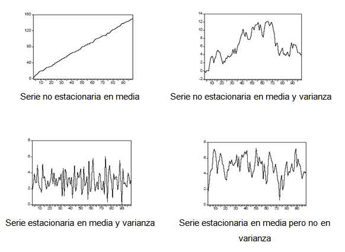
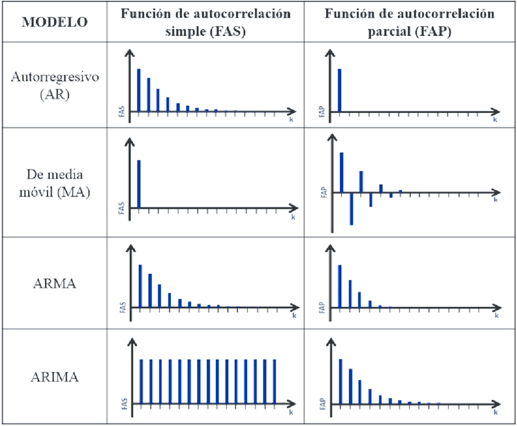
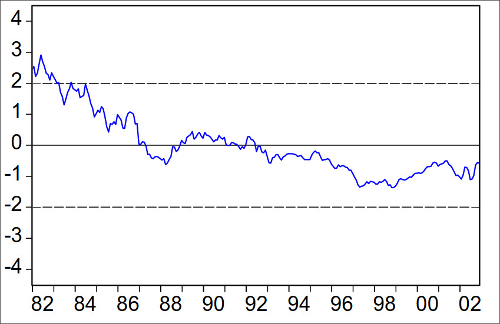
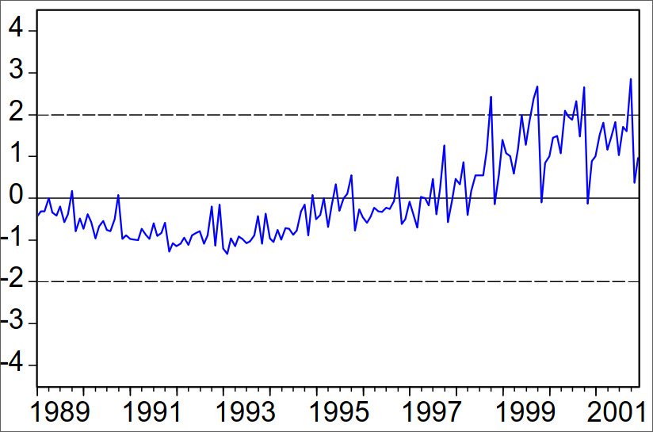
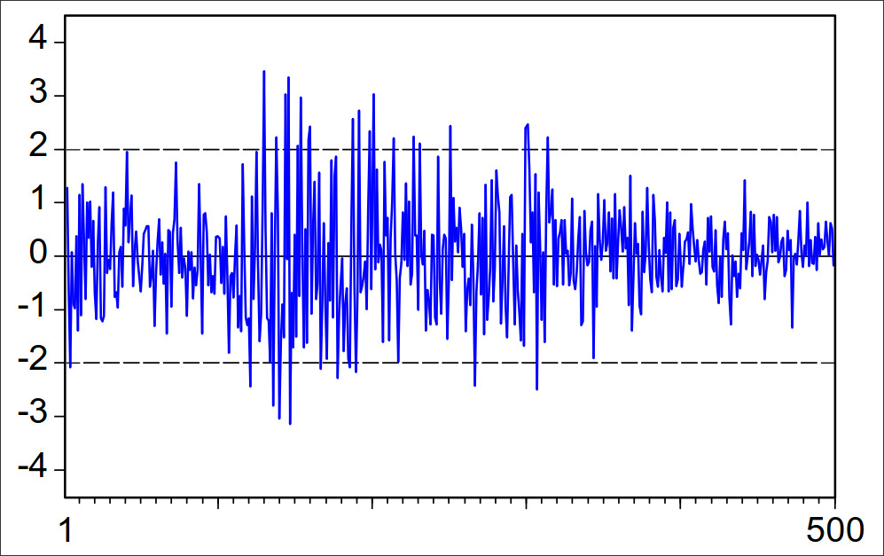
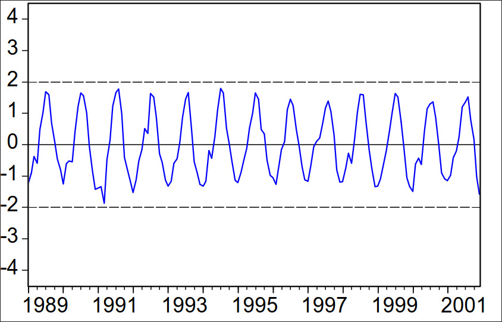
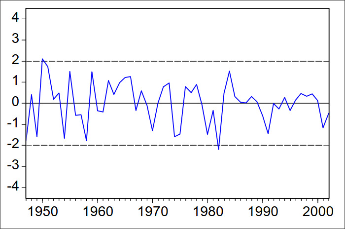
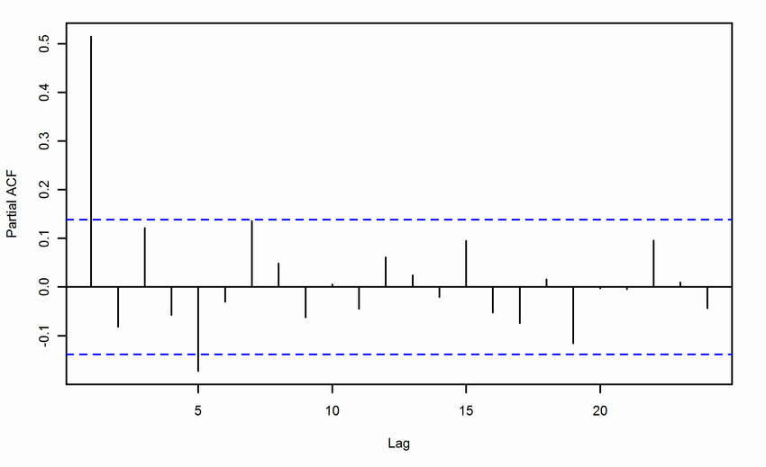
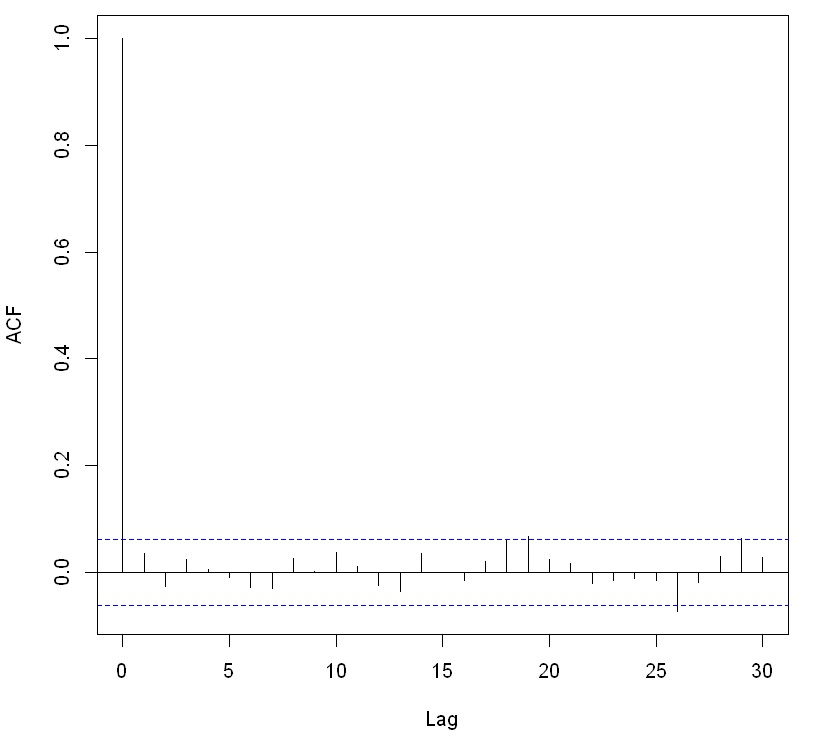

```{r setup, include=FALSE}
knitr::opts_chunk$set(
	echo = TRUE,
	message = FALSE,
	warning = FALSE,
	comment = NA
)
library(knitr)
library(learnr)
library(ggplot2)
library(RCurl)
library(gradethis)
knitr::opts_chunk$set(exercise.warn_invisible = FALSE)
# colores
c1="#FF7F00" # NARANJA COLOR PRINCIPAL
c2="#034a94" # AZUL FUERTE COLOR SECUNDARIO  
c3="#0eb0c6" # AZUL CLARO COLOR TERCEARIO  
c4="#686868" # GRIS COLOR TEXTO 
#library(PerformanceAnalytics)
#library(patchwork)
#-----------------------------------------------
Theme1= theme(axis.text.x = element_blank(),
        axis.text.y = element_blank(),
        axis.ticks = element_blank(),
        axis.title.x = element_text(size = 12),
        axis.title.y = element_text(size = 12))
#-------------------------------------------------------------------------
```
<style>body {text-align: justify}</style>


## **PRESENTACIÓN**

```{r, echo=FALSE, out.width="100%", fig.align = "center"}
knitr::include_graphics("images/banner_presentacion.png")
```

El presente tutorial contiene preguntas relacionadas con  el análisis de series temporales con R; este está estructurado en tres etapas, a saber, Introducción o recordatorio teórico, cuestionario conceptual y ejercicios prácticos usando R.

</br>

### **Introducción**

Las series de tiempo son series de datos –variables– ordenadas por orden temporal y con algún tipo de índice que indica el tiempo al que corresponde esa observación. La secuencia comúnmente se organiza en puntos de tiempo con una separación igual, en ese caso son series de tiempo con intervalos iguales. Las series de tiempo también tienen puede tener intervalos desiguales, cuando el evento que se registra no ocurre con una periodicidad establecida; a saber, los  registros de exportaciones trimestrales –con un dato por cada trimestre, así sea 0– y las exportaciones registradas en año, mes, día, hora, segundo.

En general, el objetivo de dicho análisis es establecer tres criterios: 

- Tendencia y/o comportamiento estacional de la serie temporal.
- Varianza de la serie temporal.
- Modelizar la autocorrelación serial.

Los tres  objetivos son de interés para el presente tutorial.

</br>

#### **Tendencia y estacionariedad**

Antes de usar toda la potencia del modelado estadístico y pronóstico para con  las series temporales, es menester establecer la estacionariedad o tendencia de esta. La razón fundamental es que los modelos tradicionales de pronósticos son utilizados con procesos estacionarios. Por ende, debe establecerse a partir de estadísticas descriptivas si la serie es o no estacionaria.

Una serie es estacionaria (débilmente) si la media y la varianza no varía con el tiempo. Cuando se utiliza el término tendencia, en realidad se hace referencia al comportamiento de la media respecto al tiempo. El gráfico de una serie estacionaria vs NO estacionaria sólo en media es:


```{r, echo=FALSE, out.width="70%", fig.align = "center"}
knitr::include_graphics("images/Imagen1.png")
```


Como se evidencia en el gráfico de la derecha, la media aumenta positivamente respecto al tiempo. Si la serie temporal tiene algún tipo de tendencia respecto al tiempo, se sabe por lo menos que la serie no es estacionaria en media. **Puede suceder que la tendencia de una serie no parezca seguir un patrón correcto, en ese caso de habla de una tendencia estocástica**


#### **Varianza**

En el gráfico derecho anterior era fácil evidenciar la existencia de una tendencia; de ese mismo gráfico es posible deducir que la varianza de la serie sí es constante (**Homocedasticidad**) respecto al tiempo, pues la ondulación se mantiene constante a un intervalo de la variable $X$. Si por ejemplo, la serie temporal fuese NO estacionaria en varianza tendría el siguietne gráfico:

```{r, echo=FALSE, out.width="70%", fig.align = "center"}
knitr::include_graphics("images/Imagen2.png")
```

El gráfico de la derecha presenta una serie que es estacionaria en media, pues la tendencia es constante a un valor, pero la varianza no es constante, dado que la longitud de las ondulaciones es distinta en cada instante t. En general, los cuatro tipos de gráficos y tendencias más comunes se resumen en el siguiente gráfico:


```{r, echo=FALSE, out.width="70%", fig.align = "center"}

```

#### **ACF Y PACF**

Las funciones de autocorrelación (simples y parciales) toman importancia en la etapa de modelado, pues conociendo los gráficos de autocorrelaciones de una serie estacionaria es posible modelar esta con procesos conocidos. A continuación se muestra una tabla resumen de las gŕaficas de los cuatro procesos más comunes de órden unitario: AR(1), MA(1) ...


```{r, echo=FALSE, out.width="60%", fig.align = "center"}

```
En caso de contar con procesos de segundo órden, la PACF y ACF de los procesos AR y MA respectivamente, se anularán para resagos mayores a 2.

#### **Funciones comunes en R**

- **Clase $ts$**

R cuenta con numerosas funciones para el análisis de series temporales. El uso de tales funciones requiere que los objetos a los que se aplican sean de la clase ts (time series). La función ts() convierte un objeto a serie temporal. Por ejemplo:


Suponga se cuenta con el siguiente vector de observaciones que hace referencia al total de goles marcados por algún equipo en la primer jornada:

```{r message=FALSE, warning=FALSE}
Serie=c(35,25,29,33,27,29,17,30,19,32,33,23,33,42,27,27,37,26,28,24,38,26,30,20,23,26,27,28,29,30,31,32,33,34,35,36,37,38,22,27,28,28,21,24,29,24,28,29,24,24,24)

```

Podemos convertir la sucesión de goles marcados por jornada en una serie temporal simplemente mediante:

```{r}
Goles=ts(Serie)
Goles
```

El objeto que hemos creado, goles, es un objeto de clase Time Series con inicio en 1, final en 51 y frecuencia 1; en resumen, es una simple sucesión ordenada de valores.

Ahora bien, suponga que el vector de goles anterior cuenta la cantidad de goles de un equipo en siete años; si cuenta con la fecha de inicio y su secuencia, es posble establecerlos  mediante dos argumentos de la función $ts$:

- $freq:$ Indica la unidad temporal de las observaciones, a saber: Anual (1), Trimestral (4), Mensual (12) y Semanal (52)

- $start:$ Indica la fecha de la primera observación

Así por ejemplo, crear una serie temporal de los  goles desde 1985 hasta 1991 donde cada observación corresponde al mes del año en cuestión, es:


```{r}
Goles_Mensual=ts(Serie,freq=12,start = 1985)
Goles_Mensual
```

Aquí se establece cada observación a su año respectivo, con inicio desde $1940$.

```{r}
Goles_Anual=ts(Serie,freq=1,start = 1940)
Goles_Anual
```


- **Gŕaficos**

Para graficar cualquier objeto tipo $ts$ en R se puede utilizar la función $plot()$


```{r}
plot(Goles_Anual,xlab="Año",ylab="Goles")
```

- **Gŕaficos y funciones en data frames con múltiples series temporales**

La función ts() puede aplicarse también a un dataframe que contenga varias variables; en tal caso, cada variable se convierte a serie temporal, y el dataframe adquiere la clase mts (multivariate time series). Por ejemplo:

```{r}
Serie2=data.frame(c(13,10,13,13,15,17,15,18,19,17,18,20,23,25,26,14,10,9,8,4),c(24,23,30,23,24,26,30,35,36,31,20,19,18,17,19,19,20,26,25,35),c(16.8,14.5,12.5,16.8,18.7,19.7,20.3,20.1,25.1,17.6,19.9,25.5,23.3,25.6,21.0,18.8,15.5,14.1,12.3,20))
colnames(Serie2)=c("Min","Max","Vel")
kable(head(Serie2))
```

Los datos anteriores contienen los valores mínimo, máximo y medio mensuales de temperaturas y velocidad de viento registrados. Para convertirlo en una serie temporal multivariable use:

```{r}
Serie_Multi=ts(Serie2,freq=12,start=c(1981,1))
Serie_Multi
```

La gŕafica es análoga al caso univariable:

```{r}
plot(Serie_Multi)
```

- **ACF y PACF**

Las funciones de autocorrelación simple y parcial son fundamentales para  encontrar el modelo pertinente asociado a determinada serie. Las funciones son:

- $acf():$ Función para extraer el gráfico de las autocorrelaciones
- $pacf():$ Función para extraer el gráfico de las autocorrelaciones parciales


Ahora, es momento de pasar al cuestionario.

## **CUESTIONARIO**

### **Pregunta 1**

Sea la siguiente gráfica:


```{r, echo=FALSE, , out.width="70%", fig.align = "center",fig.cap="Figura 1: Inflación interanual en España Enero 1982 – Diciembre 2002"}
  
```


```{r quiz_1, echo=FALSE}
quiz(
  question("Con base en la figura 1 puede afirmar de la tendencia:" , 
           correct = "La serie evoluciona alrededor de un nivel que cambia sin seguir aparentemente un patrón concreto, es decir, la tendencia negativa no es clara, pues en 0 se corrige.", 
           allow_retry = TRUE,
           answer("La serie presenta un tendencia lineal negativa", message = "No, pero no...intentalo de nuevo!"),
           answer("La serie presenta una tendencia estocástica (aleatoria) en su evolución temporal",  correct = TRUE),
           answer("La serie es de tendencia estacionaria", message = "Incorrecto. Intenta de nuevo!."),
           answer("La serie presenta una tendencia lineal positiva", message = "No...intentalo de nuevo!"),
           # Si no cambiamos estos textos en los botones, se mostrarán en Inglés  
           submit_button = "Enviar respuesta",
           try_again_button = "Intentar de nuevo"),
  # Si no ponemos un caption aparecerá la palabra Quiz en inglés.
  caption = " "
)
```


### **Pregunta 2**

Sea la siguiente gráfica:

```{r, echo=FALSE, out.width="70%", fig.align = "center",fig.cap="Figura 2: Viviendas iniciadas en España Enero 1989 – Diciembre 2001"}
  
```


```{r quiz_2, echo=FALSE}
quiz(
  question("Con base en la figura 2 puede afirmar que:" , 
           correct = "Al igual que la serie de la figura 1, esta no presenta una tendencia clara, además la variabilidad parece crecer con los años.", 
           allow_retry = TRUE,
           answer("La serie presenta un tendencia lineal positiva", message = "No, pero no...intentalo de nuevo!"),
           answer("La serie no es estacionaria, pues la tendencia y la varianza no son constantes en el tiempo",  correct = TRUE),
           answer("La serie es de tendencia estocástica y varianza constante", message = "Incorrecto. Intenta de nuevo!."),
           answer("La serie es estacionaria en varianza pero no en media", message = "No...intentalo de nuevo!"),
           # Si no cambiamos estos textos en los botones, se mostrarán en Inglés  
           submit_button = "Enviar respuesta",
           try_again_button = "Intentar de nuevo"),
  # Si no ponemos un caption aparecerá la palabra Quiz en inglés.
  caption = " "
)
```


### **Pregunta 3**

Sea la siguiente gráfica:

```{r, echo=FALSE , out.width="70%", fig.align = "center",fig.cap="Figura 3: Tasa de variación diaria del IBEX 353 de enero de 2002 – 30 de diciembre de 200"}
  
```

```{r quiz_3, echo=FALSE}
quiz(
  question("Con base en la figura 3 puede afirmar que:" , 
           correct = "La tendencia es constante, más sin embargo, la variabilidad no; pues no es constante a lo largo del tiempo (disminuye al final) ", 
           allow_retry = TRUE,
           answer("La serie tiene tendencia y variabilidad constante", message = "No, pero no...intentalo de nuevo!"),
           answer("La serie no es estacionaria débil, pues la tendencia y la varianza no son constantes en el tiempo",message = "No...intentalo de nuevo!"),
           answer("La serie es estacionaria, pues tanto la media como la varianza son constantes en el tiempo", message = "Incorrecto. Intenta de nuevo!."),
           answer("La serie es estacionaria en media pero no en varianza",correct = TRUE),
           # Si no cambiamos estos textos en los botones, se mostrarán en Inglés  
           submit_button = "Enviar respuesta",
           try_again_button = "Intentar de nuevo"),
  # Si no ponemos un caption aparecerá la palabra Quiz en inglés.
  caption = " "
)
```

### **Pregunta 4**

Sea la siguiente gráfica:

```{r, echo=FALSE, out.width="70%", fig.align = "center",fig.cap="Figura 4: Temperatura media registrada en Madrid-Retiro Enero 1989 – Diciembre 2001"}
  
```

```{r quiz_4, echo=FALSE}
quiz(
  question("Con base en la figura 4 puede afirmar que:" , 
           correct = "La tendencia y la varianza es constante respecto al tiempo", 
           allow_retry = TRUE,
           answer("La serie sólo tiene media estacionaria", message = "No, pero no...intentalo de nuevo!"),
           answer("La serie no es estacionaria, pues la tendencia y la varianza no son constantes en el tiempo",message = "No...intentalo de nuevo!"),
           answer("La serie no es estacionaria, pues la varianza aumenta con el tiempo", message = "Incorrecto. Intenta de nuevo!."),
           answer("La serie es estacionaria, pues tanto la media como la varianza son canstantes en el tiempo",correct = TRUE),
           # Si no cambiamos estos textos en los botones, se mostrarán en Inglés  
           submit_button = "Enviar respuesta",
           try_again_button = "Intentar de nuevo"),
  # Si no ponemos un caption aparecerá la palabra Quiz en inglés.
  caption = " "
)
```


### **Pregunta 5**

Sea la siguiente gráfica:

```{r, echo=FALSE, out.width="70%", fig.align = "center",fig.cap="Figura 5: Tasa logarítmica de variación anual del PIB real en EEUU 1947 – 2002"}
  
```

```{r quiz_5, echo=FALSE}
quiz(
  question("Con base en la figura 5 puede afirmar que:" , 
           correct = "La tendencia y la varianza es constante respecto al tiempo", 
           allow_retry = TRUE,
           answer("La serie sólo tiene media estacionaria", message = "No, pero no...intentalo de nuevo!"),
           answer("La serie no es estacionaria, pues la tendencia y la varianza no son constantes en el tiempo",message = "No...intentalo de nuevo!"),
           answer("La serie es estacionaria",correct = TRUE),
           answer("La serie no presenta varianza constante, pues esta varía respecto al tiempo" ,message = "No...intentalo de nuevo!"),
           
           # Si no cambiamos estos textos en los botones, se mostrarán en Inglés  
           submit_button = "Enviar respuesta",
           try_again_button = "Intentar de nuevo"),
  # Si no ponemos un caption aparecerá la palabra Quiz en inglés.
  caption = " "
)
```


### **Pregunta 6**

Suponga la siguente gráfica corresponde a una de las funciones de autocorrelaciones de una serie estacionaria:

```{r, echo=FALSE, out.width="70%", fig.align = "center",fig.cap="Figura 5: Tasa logarítmica de variación anual del PIB real en EEUU 1947 – 2002"}
  
```

```{r quiz_6, echo=FALSE}
quiz(
  question("Con base en la figura 6 puede afirmar que:" , 
           correct = "Dado que la PACF se anula para resagos mayores a 2, es correcto suponer que un modelo adecuado para modelar la serie es el AR(2)", 
           allow_retry = TRUE,
           answer("La serie pertenece a un modelo MA(2), dado que la PACF se anula con resagos mayores a 2", message = "No, pero no...intentalo de nuevo!"),
           answer("La serie pertenece a un modelo MA(1), dado que la PACF se anula con resagos mayores a 1" ,message = "No...intentalo de nuevo!"),
           answer("La serie pertenece a un modelo AR(2), dado que la PACF se anula con resagos mayores a 2",correct = TRUE),
           answer("La serie pertenece a un modelo AR(1), dado que la PACF se anula con resagos mayores a 1" ,message = "No...intentalo de nuevo!"),
           
           # Si no cambiamos estos textos en los botones, se mostrarán en Inglés  
           submit_button = "Enviar respuesta",
           try_again_button = "Intentar de nuevo"),
  # Si no ponemos un caption aparecerá la palabra Quiz en inglés.
  caption = " "
)
```


### **Pregunta 7**

Suponga la siguente gráfica corresponde a una de las funciones de autocorrelaciones de una serie estacionaria:

```{r, echo=FALSE, out.width="70%", fig.align = "center",fig.cap="Figura 5: Tasa logarítmica de variación anual del PIB real en EEUU 1947 – 2002"}
  
```

```{r quiz_7, echo=FALSE}
quiz(
  question("Con base en la figura 6 puede afirmar que:" , 
           correct = "Dado que la ACF se anula para resagos mayores a 1, es correcto suponer que un modelo adecuado para modelar la serie es MA(1)", 
           allow_retry = TRUE,
           answer("La serie pertenece a un modelo MA(2), dado que la PACF se anula con resagos mayores a 2", message = "No, pero no...intentalo de nuevo!"),
           answer("La serie pertenece a un modelo MA(1), dado que la ACF se anula con resagos mayores a 1" ,correct = TRUE),
           answer("La serie pertenece a un modelo AR(2), dado que la ACF se anula con resagos mayores a 2", message = "No, pero no...intentalo de nuevo!"),
           answer("La serie pertenece a un modelo AR(1), dado que la ACF se anula con resagos mayores a 1" ,message = "No...intentalo de nuevo!"),
           
           # Si no cambiamos estos textos en los botones, se mostrarán en Inglés  
           submit_button = "Enviar respuesta",
           try_again_button = "Intentar de nuevo"),
  # Si no ponemos un caption aparecerá la palabra Quiz en inglés.
  caption = " "
)
```


## **PROBLEMAS**

```{r message=FALSE, warning=FALSE, include=FALSE}
Jhon_y_Jhonson = scan('http://verso.mat.uam.es/~joser.berrendero/datos/jj.dat')
Ts_jj=ts(Jhon_y_Jhonson,freq=4) # Definiendo la serie trimestral
Tiempo_encontrado=1980.50
```

### **Problema 1**

Usted cuenta con un vector ya cargado llamado $Jhon_y_Jhonson$, este contiene los beneficios trimestrales de la empresa Johnson & Johnson entre 1960 y 1980. Escriba el código faltante en R para responder a las siguientes preguntas:

- Defina la serie temporal  como "Ts_jj" y grafíquela
- ¿Cuál es el valor de la serie para el tercer trimestre de 1980? 
- ¿Cuáles son las principales características (tendencia, estacionalidad) de esta serie?


```{r p1, exercise=TRUE, exercise.lines = 5}
Jhon_y_Jhonson = scan('http://verso.mat.uam.es/~joser.berrendero/datos/jj.dat')

```


```{r p1-hint-1}
Ts_jj=ts(Jhon_y_Jhonson,freq=4) # Definiendo la serie trimestral
```


```{r p1-hint-2}
#Para conocer cuál es el valor del beneficio asociado a determinada fecha, primero debe conocer qué tiempo se asignó R a cada valor, esto se consigue con la función time(Ts_jj)

time(Ts_jj)

# Posteriormente deberá referenciar dicho valor en el vector ts, es decir: 

Ts_jj[time(Ts_jj)==Tiempo_encontrado]

```


```{r p1-solution}
Ts_jj=ts(Jhon_y_Jhonson,freq=4,start = 1960) # Definiendo la serie trimestral
plot(Ts_jj) # Gráfica
time(Ts_jj) # conocer las fechas asignadas a cada valor
Ts_jj[time(Ts_jj)==1980.50] # Extraer el feneficio asociado a la fecha del tercer trimetres en 1980
```

```{r p1-check}
grade_this({
  if(identical(.result,(16.02))){
    pass("¡Muy bien!, obtuvo el valor correcto")
  }
  fail("Por favor intente de nuevo, revise las pistas y/o la solución para conocer la estructura deseada")
}
  
)

```


### **Problema 2**

Se le asignó explorar patrones en los vuelos que llegan al Aeropuerto Internacional Logan (BOS) de Boston. En este ejercicio, verá la estructura y las cualidades de algunos datos en preparación para la manipulación de series temporales. La base que debe cargar presenta los tiempos de llegada de los vuelos. Escriba las lineas de código necesarias para realizar las siguientes tareas:

- Importe la los datos, estos se encuentran en un archivo con formato .RData de nombre "Vuelos"; la carpeta que los contiene tiene como directorio "./data"  

- Los datos presentan una columna de la fecha de cada vuelo, establezca dicha columna como referencia para crear una serie temporal de la variable "total_flights". En cuentre la fecha de inicio y la frecuencia correcta de la variable fecha. Finalmente cree el objeto tipo $ts$ y llámelo "Vuelo_TS".

- Grafique la serie

- Finalmente realice los gráficos de las autocorrelaciones (ACF y PACF).

```{r p2, exercise=TRUE, exercise.lines = 8}

```


```{r p2-hint-1}
# Para leer los datos en formato RData se usa la función readRDS()

readRDS("./data/Vue..")

```


```{r p2-hint-2}
# Note que la frecuencia es mensual, freq=12, sólo resta establecer la fecha de inicio


Vuelo_TS=ts(Vuelos$...,freq=12,start = ...) 
```


```{r p2-solution}
Vuelos=readRDS("./data/Vuelos.RData") # Importar datos
Vuelo_TS=ts(Vuelos$total_flights,freq=12,start = 2010) # La frecuencia es mensual
plot(Vuelo_TS) # Gráfica
acf(Vuelo_TS) # ACF
pacf(Vuelo_TS) # PACF
```

```{r p2-check}
grade_this({
  if(identical(.result, .solution)){
    pass("¡Muy bien!")
  }
  fail("Por favor intente de nuevo, revise las pistas y/o la solución para conocer la estructura deseada")
})
```


### **Problema 3**

Suponga usted cuenta con una serie en un archivo en formato .txt llamanda como "S3". La carpeta que  contiene el archivo tiene como directorio "./data"; escriba el código necesario para:

- Importar los datos de la serie S3
- Cree el objeto ts llamándolo "Serie", no establezca ninguna fecha para la serie. 
- Grafique la serie, ¿Considera que es estacionaria?
- Grafique la PACF y ACF y concluya cuál proceso de los vistos es el pertinente para modelar la serie


```{r p3, exercise=TRUE, exercise.lines = 8}

```


```{r p3-hint}
# Para importar datos en formato .txt use:

read.table("./data/..") 

```


```{r p3-solution}
Serie=read.table("./data/S3.txt") # Se carga los datos de al serie
plot(Serie) # Se grafica la serie
par(mfrow=c(1,2)) # Permite unir los siguientes gráficos en un solo cuadrante (NO ES NECESARIO)
ACF=acf(Serie)
PACF=pacf(Serie)
# La serie pertenece a un proceso AR(1)
```

```{r p3-check}
grade_this({
  if(identical(.result, .solution)){
    pass("¡Muy bien!")
  }
  fail("Por favor intente de nuevo, revise las pistas y/o la solución para conocer la estructura deseada")
})
```


