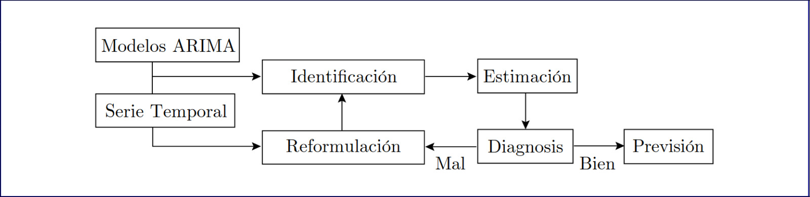
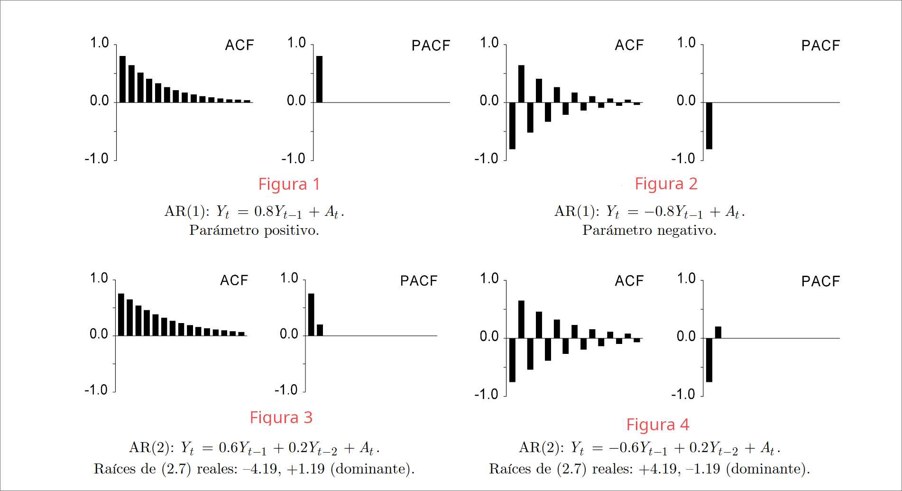
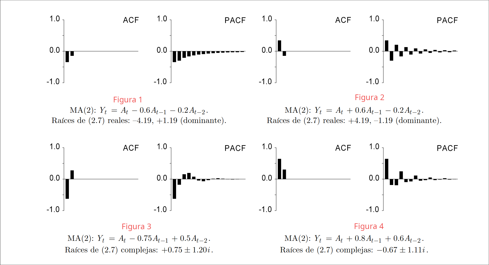
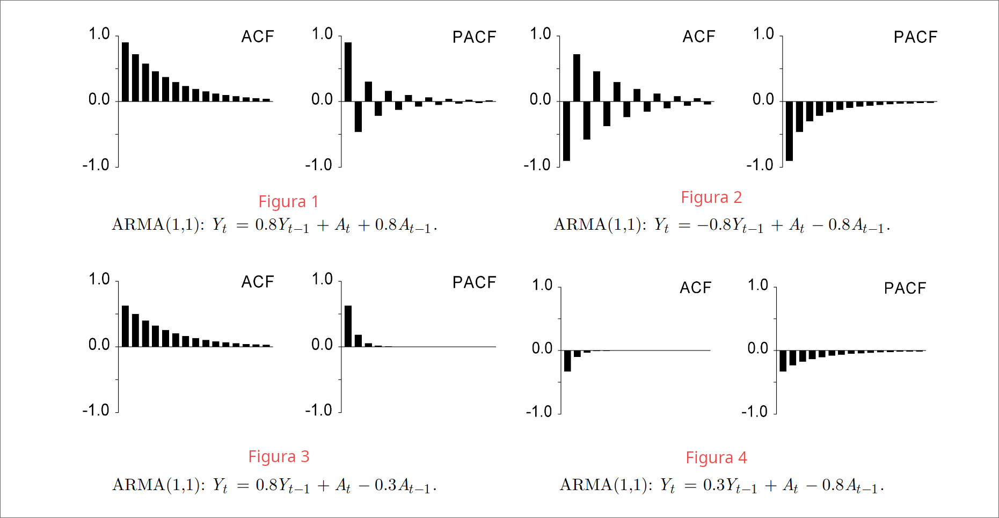
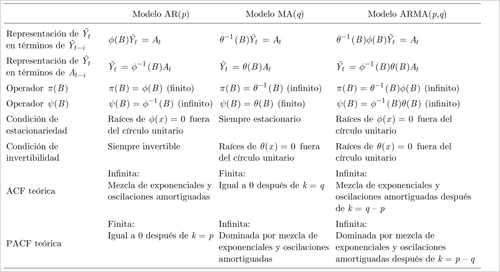
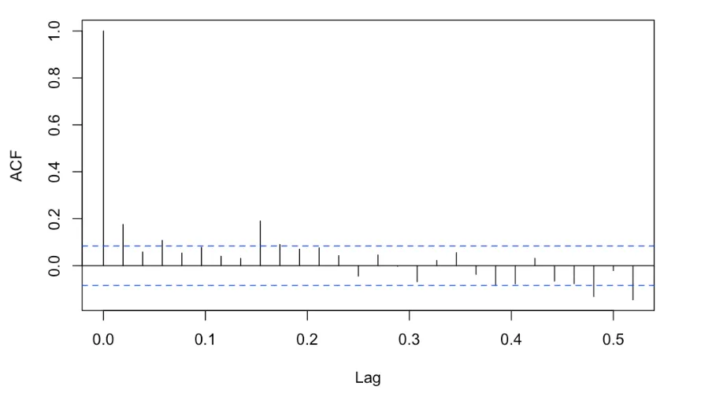
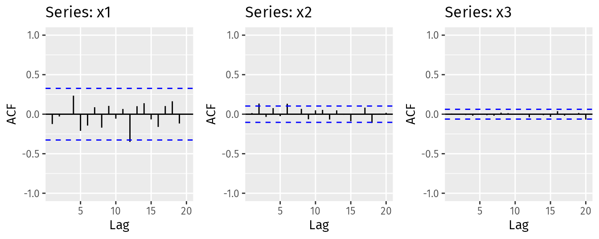

```{r setup, include=FALSE}
knitr::opts_chunk$set(
	echo = TRUE,
	message = FALSE,
	warning = FALSE,
	comment = NA
)
library(knitr)
library(learnr)
library(ggplot2)
library(RCurl)
library(gradethis)
knitr::opts_chunk$set(exercise.warn_invisible = FALSE)
# colores
c1="#FF7F00" # NARANJA COLOR PRINCIPAL
c2="#034a94" # AZUL FUERTE COLOR SECUNDARIO  
c3="#0eb0c6" # AZUL CLARO COLOR TERCEARIO  
c4="#686868" # GRIS COLOR TEXTO 
#library(PerformanceAnalytics)
#library(patchwork)
#-----------------------------------------------
Theme1= theme(axis.text.x = element_blank(),
        axis.text.y = element_blank(),
        axis.ticks = element_blank(),
        axis.title.x = element_text(size = 12),
        axis.title.y = element_text(size = 12))
#-------------------------------------------------------------------------
```
<style>body {text-align: justify}</style>


## **PRESENTACIÓN**

```{r, echo=FALSE, out.width="100%", fig.align = "center"}

```

El presente tutorial abordará la parte de estimación y modelado de procesos estocásticos univariantes con R; este está estructurado en tres etapas: Introducción o recordatorio teórico, cuestionario conceptual y ejercicios prácticos usando R. **Tenga presente que el presente tutorial da por sentado que el estudiante reconoce los conceptos clave de los procesos estocásticos, a saber, media, varianza, covarianza, función de autocorrelación (ACF) y función de autocorrelación parcial (PACF). También asume que conoce los modelos $ARMA(p,q)$ y su estructura**

</br>

### **Introducción**

Las etapas en la construcción de un modelo univariable en series temporales son:

- Estacionariedad: Validar la estacionariedad de la serie, en caso de ser necesario, usar transformaciones. 

- Identificación: Selección de un modelo cuyas propiedades teóricas sean compatibles con las propiedades muestrales observadas.

- Estimación: Estimar los parámetros del modelo ajustado

La siguiente figura simplifica las anteriores etapas:


```{r, echo=FALSE, out.width="100%", fig.align = "center",fig.cap="Figura 1:  Mapa conceptual"}

```


</br>

#### **Estacionariedad**

Se dice que un proceso  estocástico $(Y_t)$ es estacionario (o débilmente estacionario de segundo orden) si y sólo si:

- $E[Y_t]$ y $Var[Y_t]$ no dependen de t, es decir, son constantes en el tiempo.
- $Cov[Y_t,Y_{t+k}]$ depende a lo sumo de k (rezago) pero no de t.

En el tutorial descriptivo se validó la estacionariedad en función de las gráficas, más sin embargo, es posible validar la estacionariedad de una serie con pruebas formales. Este es el caso de la prueba de Dickey y Fuller, que busca  determinar si una serie temporal tiene raíces unitarias; es decir, si la serie temporal es estacionaria o no estacionaria. La hispótesis estadísticas de la prueba son:

$$H_0:\text{La series es no estacionaria (Tiene raíz unitaria)} $$
$$H_1:\text{La series es estacionaria (No tiene raíz unitaria)} $$
Para realizar la prueba en R se debe instalar y cargar la librería "tseries". La función para aplicar esta es:


```{r eval=FALSE, include=TRUE}
install.packages("tseries");library("tseries") # Instalar y cargar las librerias
tseries::adf.test(Serie) # Aplicar la prueba a un vector tipo ts en R

```


#### **Identificación**

Los modelos base para procesos estocásticos son:

- Autorregresivo de orden $p$, $AR(p)$
- Media movil de orden $q$, $MA(q)$

En general, ambos modelos nacen de la simplificación de uno solo: modelo autorregresivo-media móvil de orden $(p,q)$, o $ARMA(p,q)$. 

Ahora bien, una vez que se ha validado la estacionariedad de un vector, la pauta clave para la identificación del modelo a ajustar son las AFC y PACF. Las funciones de autocorerlaciones pueden variar en función de los parámetros del modelo, por lo tanto a constinuación se presentan las carácterísticas principales para cada modelo:

##### AR(p)

Un proceso es autoregresivo de orden P si se define por la siguiente ecuación:

$$X_t = c + \phi_1 X_{t-1} + \phi_2 X_{t-2} + \cdots + \phi_p X_{t-p} + a_t$$
La condición más importante en este es la estacionariedad, es decir, Las raíces del polinomio característico del proceso AR(p) deben estar fuera del círculo unitario. Esto garantiza que el proceso AR(p) sea estacionario y que las soluciones sean finitas. Si por ejemplo, el proceso es AR(1), el valor absoluto del parámetro de autoregresión, $|\phi|$, debe ser menor que 1. Esto garantiza que la serie temporal sea estacionaria.Las características claves para los modelos AR(p) son


- Función de autocorrelación (ACF): la ACF de un proceso AR(p) decae exponencialmente hacia cero a medida que aumenta el retraso, y se anula para todos los rezagos mayores que $p$.

- Función de autocorrelación parcial (PACF): la PACF de un proceso AR(p) tiene un corte abrupto después del rezago $p$, lo que indica que para rezagos mayores a $p$, la correlación es estadísticamente cero.


Tome la siguientes figuras como referencia:


```{r, echo=FALSE, , out.width="100%", fig.align = "center",fig.cap="Figura 2:  Ejemplos de funciones de autocorrelación de un proceso AR(p)"}
  
```


De ellas puede extraer que:

- De los procesos AR(1), la ACF decrece rápidamente despues del primer rezago. Por otro lado, la PACF es nula para rezagos mayores a 1. La misma lógica aplica para los modelos AR(2)

- Note que si el parámetro es negativo en un modelo AR(1), la AFC sigue una estructura intercalada y la PACF es negativa. En caso de ser un proceso AR(2) un parámetro negativo, la AFC también es intercalado.


##### MA(q)


Un proceso es medias móviles (MA) de orden $q$ si se define por la siguiente ecuación:

$$X_t = \mu + a_t + \theta_1 a_{t-1} + \theta_2 a_{t-2} + \cdots + \theta_q a_{t-q}$$

Las características claves para los modelos MA(q) son


- Función de autocorrelación (ACF): la ACF de un proceso MA(Q) tiene un corte abrupto después del rezago $q$, lo que indica que para rezagos mayores a $q$, la correlación es estadísticamente cero. $p$.

- Función de autocorrelación parcial (PACF): la PACF de un proceso MA(Q)tiene picos significativos en los primeros $q$ rezagos y luego decae a  cero.


Tome la siguientes figuras como referencia:


```{r, echo=FALSE, , out.width="100%", fig.align = "center",fig.cap="Figura 3:  Ejemplos de funciones de autocorrelación de un proceso MA(q)"}
  
```

##### ARMA(p,q)

La caracterizacioń gráfica de las funciones de autocorrelación de los modelos $ARMA(p,q)$ es un poco más compleja, a continuación se muestran diferentes gráficas de este:


```{r, echo=FALSE, , out.width="100%", fig.align = "center",fig.cap="Figura 4:  Ejemplos de funciones de autocorrelación de un proceso ARMA(1,1)"}
  
```


La siguiente tabla simplifica la información más relevante para los modelos $ARMA(p,q)$

```{r, echo=FALSE, out.width="100%", fig.align = "center", fig.cap="Figura 5:  Características de los modelos ARMA(p,q)"}

```
**Tenga en cuenta que en los gráficos ACF y PACF de un ARMA(P,A), puede no ser claro si se están reduciendo o cortando. Con ARMA, los órdenes de p y q para AR y MA pueden ser más de uno. Por lo tanto, se recomienda probar algunas combinaciones p y q para obtener la mejor puntuación de AIC y BIC.**

#### ARIMA (p,d,q)

Un modelo ARIMA (p, d, q) se usa especialmente cuando la serie no es estacionaria y se necesita diferenciación para convertirla en una serie estacionaria. Esta se compone de:

- El modelo autoregresivo (AR) de orden p.

- El modelo integrado (I) de orden d, que se utiliza para transformar una serie no estacionaria en una serie estacionaria mediante la diferenciación. El parámetro d indica la cantidad de veces que se diferencia la serie de tiempo para obtener una serie estacionaria.

- El modelo de media móvil (MA) de orden q.

#### Ejemplo de aplicación y códigos en R

Suponga que se tiene la siguiente serie:

```{r}
RawData=scan('https://www.diegocalvo.es/wp-content/uploads/2016/09/datos-serie-temporal.txt')
serie = ts(RawData, start = c(1966,1), frequency = 12)
plot(serie,xlab="Años",ylab="Datos")
```

Como se podrá suponer, la serie muestra una clara no estacionariedad. Además, graficando la ACF parciales de la serie se tiene:


```{r}
acf(serie)
```


La cual muestra no estacionariedad en la serie dado que el valor de la función de autocorrelación no decae de manera exponencial a medida que aumentan los rezagos en el tiempo. Para estos casos es menester descomponer la serie en tres componentes:

- Tendencia: cómo están cambiando las cosas en general. Un sitio web cada vez más popular debe mostrar una tendencia general que sube. 

- Estacional o Periódico: Patrones que se repiten con un período fijo de tiempo. Por ejemplo, un sitio web puede recibir más visitas durante los fines de semana; esto produciría datos con una estacionalidad de 7 días. 

- Aleatorio/error/residuo: también llamado "ruido", estos son los residuos de la serie de tiempo original después de que se eliminan las series estacionales y de tendencia. 

**Con la anterior descomposición se busca identificar el factor responsable de la no estacionariedad y corregirlo**

En R esto sería:

```{r}
Descomposición=decompose(serie)
plot(Descomposición)
```

Cuya descomposición muestra que tiene dos responsables de la no estacionariedad: La tendencia y la estacionalidad. El modelo que vamos a utilizar es un modelo ARIMA, diferenciando la serie se logrará que sea convertida a estacionaria. Para conocer el número de diferenciaciones regulares que requiere una serie para aliminar la tendencia se usa la función $ndiffs()$ del paquete "forecast". Para conocer el número de periodos estacionales de una serie se usa la función $nsdiffs()$.

```{r}
library("forecast")
ndiffs(serie) # Diferenciaciones necesarias para eliminar la tendencia
nsdiffs(serie) # Indica la priodicidad estacional
```

Lo anterior nos indica que:

- Se requiere una diferenciación para eliminar la tendencia.
- El componente estacional de la serie es unitario, es decir, el patrón se repite por unidad de tiempo (en este caso años).

Para defereciar la serie, se usa la función $diff()$ en R.

```{r}
serie_dif=diff(serie)
plot(serie_dif)
```

Una vez nuestra se soluciona la tendencia de la serie, debemos eliminar la estacionalidad de los datos, es decir, restar el componente estacional de la serie original(media cero) y luego lo diferenciamos para que sea estacionario (varianza constante e independiente). 

```{r}
serie_ajust=serie-Descomposición$seasonal # Se elimina la componente de estacionalidad del modelo
serie_estacionaria=diff(serie_ajust,differences=1) # Se elimna la componente de tendencia en la serie
```

El orden a seguir para convertir una serie en estacionaria es: 1) Eliminar la componente de estacionalidad y 2) eliminar la componente de tendencia. Así, ya contamos con la serie finalmente trasnformada y estacionaria. Finalmente aplicamos la prueba de Dickey y Fuller para validad la estacionariedad.


```{r}
tseries::adf.test(serie_estacionaria) 
```
Y con una significancia del 5%, existe suficiente evidencia estadística para concluir que la serie diferenciada es estacionaria. Ahora bien, lo que resta es identificar el las componentes AR(p) y MA(q) del modelo ARIMA(p,1,q); para realizar esto se grafican las funciones de autocorrelación de la serie estacionaria.


```{r}
par(mfrow=c(1,2))
acf(serie_estacionaria, lag.max=140)
pacf(serie_estacionaria, lag.max=140)
```

Como se evidencia, a partir del primer rezago (la primera línea hace referencia al rezago 0, esta siempre es 1) las funciones se anulan. La ACF es nula a partir de $k=1$ y la PACF decrece  a partir de $k=1$. Dado lo anterior, se podría pensar en un modelo ARMA(1,1). Así que finalmente se ajustará un modelo ARIMA(1,1,1) a la serie original:

```{r}
Modelo=arima(serie, order=c(1,1,1),seasonal = list(order = c(1,0,0), period = 12),method="ML")
```

La función en general para aplicar los modelos vistos es $arima$. Así, si se quiere ajustar un modelo AR(1) se ajustaria un $arima(1,0,0)$ y así para los modelos MA(q) y ARMA(p,q). Los argumentos de esta son:

- **order:** Especifica la parte no estacional del modelo ARIMA: (p, d, q) se refiere al orden AR, el grado de diferencia y la orden MA. 

- **seasonal:** Especifica la parte estacional del modelo ARIMA, más el período (que por defecto es la frecuencia (x), es decir, 12 en este caso). Esta función requiere una lista con el orden de los componentes pero dado en un vector numérico de longitud 3, y el período.

- **method:** Se refiere al método de estimación, que puede ser «Máxima verosimilitud (ML)» o «minimizaciónde  la suma de cuadrados condicional (CSS)». El valor predeterminado es el segundo método.

Finalmente, las estimaciones del modelo son:

```{r}
Modelo
```

**Recuerde que puede comparar varios modelos con distintos criterios. El criterio de informacion de Akaike (AIC) es uno de ellos.**

Ahora bien, finalizado la presentación del documento, es momento de pasar al cuestionario.

## **CUESTIONARIO**

### **Pregunta 1**

Sea la siguiente figura con gráfico de tiempo y gráficos ACF y PACF para los datos ajustados estacionalmente diferenciados en primer orden:


```{r, echo=FALSE, , out.width="100%", fig.align = "center",fig.cap="Figura 1: ráfico de tiempo y gráficos ACF y PACF para los datos de equipos eléctricos ajustados estacionalmente diferenciados. "}
knitr::include_graphics("images/Imagen4.png")  
```


```{r quiz_1, echo=FALSE}
quiz(
  question("Con base en la figura 1 puede afirmar que:" , 
            correct = "Correcto, la PACF corta para rezagos mayores a 3, por lo es el modelo ARIMA(3,1,0) es un buen candidato. Además que la serie está diferenciada (d=1) ", 
           allow_retry = TRUE,
           answer("Los datos son claramente no estacionarios, ya que la serie se desplaza hacia arriba y hacia abajo durante largos períodos.", message = "No, pero no...intentalo de nuevo!"),
           answer("La PACF que se muestra en la figura sugiere un modelo AR(3). Entonces, un modelo candidato inicial es un ARIMA (3,1,0).",  correct = TRUE),
           answer("La PACF que se muestra en la figura sugiere un modelo ARMA(3,1). Entonces, un modelo candidato inicial es un ARIMA (3,0,1).", message = "Incorrecto. Intenta de nuevo!."),
           answer("La ACF que se muestra en la figura sugiere un modelo ARMA(1,1). Entonces, un modelo candidato inicial es un ARIMA (1,1,1).", message = "No...intentalo de nuevo!"),
           # Si no cambiamos estos textos en los botones, se mostrarán en Inglés  
           submit_button = "Enviar respuesta",
           try_again_button = "Intentar de nuevo"),
  # Si no ponemos un caption aparecerá la palabra Quiz en inglés.
  caption = " "
)
```


### **Pregunta 2**

Selecione la afirmación que considere verdadera:

```{r quiz_2, echo=FALSE}
quiz(
  question("Puede afirmar que:" , 
           correct = "¡Correcto! Es importante recordar que el AIC es solo un indicador para seleccionar modelos y debe ser utilizado junto con otras técnicas de evaluación", 
           allow_retry = TRUE,
           answer("A una serie temporal es posible asociar varios modelos, por lo cual es pertinente plantear varios y compararlos. Un indicador posible es el AIC, con el  cual se selecciona el modelo con menor valor en este", correct = TRUE),
           answer("El modelo con el menor AIC siempre es el mejor modelo para la serie de tiempo, independientemente de la complejidad del modelo", message = "Incorrecto. Intenta de nuevo!",),
           answer("Si dos modelos tienen valores AIC similares, entonces el modelo más simple siempre es mejor que el modelo más complejo.", message = "Incorrecto. Intenta de nuevo!."),
           answer("El modelo con el menor AIC siempre es el mejor modelo para la serie de tiempo, independientemente de la complejidad del modelo.", message = "No...intentalo de nuevo!"),
           # Si no cambiamos estos textos en los botones, se mostrarán en Inglés  
           submit_button = "Enviar respuesta",
           try_again_button = "Intentar de nuevo"),
  # Si no ponemos un caption aparecerá la palabra Quiz en inglés.
  caption = " "
)
```


### **Pregunta 3**

Sea la siguiente gráfica de un serie no diferenciada:

```{r, echo=FALSE , out.width="100%", fig.align = "center",fig.cap="Figura 2: ACF y PACF de un serie temporal"}
knitr::include_graphics("images/Imagen6.png")  
```

```{r quiz_3, echo=FALSE}
quiz(
  question("Con base en la figura 2 puede afirmar que:" , 
           correct = "La PACF decrece a partir de k=1 y la ACF es nula para k>1, son las condiciones de un MA(1)", 
           allow_retry = TRUE,
           answer("Dado que la PACF decrece a partir del rezago tres, se puede pensar en un modelo AR(3).
", message = "No, pero no...intentalo de nuevo!"),
           answer("Dado que la PACF decrece a partir del rezago tres y la ACF es nula a partir del primer rezago, se puede pensar en un modelo ARMA(3,1).", message = "Incorrecto. Intenta de nuevo!."),
           answer("Dado la ACF es nula a partir del primer rezago, se puede pensar en un modelo AR(1).", message = "Incorrecto. Intenta de nuevo!."),
           answer("Dado la ACF es nula a partir del primer rezago, se puede pensar en un modelo MA(1)",correct = TRUE),
           # Si no cambiamos estos textos en los botones, se mostrarán en Inglés  
           submit_button = "Enviar respuesta",
           try_again_button = "Intentar de nuevo"),
  # Si no ponemos un caption aparecerá la palabra Quiz en inglés.
  caption = " "
)
```

### **Pregunta 4**

Sea las siguientes gráficas funciones de ACF y PACF de una serie estacionaria:

```{r, echo=FALSE, out.width="100%", fig.align = "center",fig.cap="Figura 3: ACF"}
  
```

```{r, echo=FALSE, out.width="100%", fig.align = "center",fig.cap="Figura 4: PACF"}
knitr::include_graphics("images/Imagen6.png")  
```


```{r quiz_4, echo=FALSE}
quiz(
  question("Con base en la figura 3 y 4 selecione las afirmaciones correctas:" , 
           correct = "Correcto, con ARMA, los órdenes de p y q para AR y MA pueden ser más de uno.", 
           allow_retry = TRUE,
           
           answer("Para obtener el valor p de AR para el modelo ARMA, veremos las gráficas PACF. Los picos están en 1 y 3. Por lo tanto, es AR(1) y AR(3).", correct = TRUE),
           
           answer("Para obtener el valor q, veremos el gráfico ACF. Los picos están en 1 y 3. Por lo tanto, es MA(1) y MA(3).",correct = TRUE),
           
           answer("En los gráficos ACF y PACF se evidencia un modelo ARMA(3,0)", message = "Incorrecto. Intenta de nuevo!."),
           answer("En los gráficos ACF y PACF, no está claro si se están reduciendo o cortando; por lo cual es pertinente plantear varios modelos y compararlos",correct = TRUE),
           # Si no cambiamos estos textos en los botones, se mostrarán en Inglés  
           submit_button = "Enviar respuesta",
           try_again_button = "Intentar de nuevo"),
  # Si no ponemos un caption aparecerá la palabra Quiz en inglés.
  caption = " "
)
```


### **Pregunta 5**

Sea la siguiente figura conformada por tres ACF:

```{r, echo=FALSE, out.width="100%", fig.align = "center",fig.cap="Figura 5: ACF para tres series"}
  
```

```{r quiz_5, echo=FALSE}
quiz(
  question("Con base en la figura 5 puede afirmar que:" , 
           correct = "Correcto, note que todas las correlaciones son nulas independientemente del rezago", 
           allow_retry = TRUE,
           answer("Las tres ACF provienen de un proceso AR(1)", message = "No, pero no...intentalo de nuevo!"),
           answer("Las tres  ACF provienen de un proceso MA(1)"),
           answer("Las tres ACF provienen de series ruido blanco",correct = TRUE),
  
           answer("Las tres ACF provienen de un proceso ARIMA(0,0,1)" ,message = "No...intentalo de nuevo!"),
           
           # Si no cambiamos estos textos en los botones, se mostrarán en Inglés  
           submit_button = "Enviar respuesta",
           try_again_button = "Intentar de nuevo"),
  # Si no ponemos un caption aparecerá la palabra Quiz en inglés.
  caption = " "
)
```


## **PROBLEMAS**

```{r message=FALSE, warning=FALSE, include=FALSE}

```

### **Problema 1**

Suponga usted cuenta con una serie en un archivo en formato .txt llamanda como "S1". La carpeta que  contiene el archivo tiene como directorio "./data"; escriba el código necesario para:

- Importar los datos de la serie S1
- Cree el objeto ts llamándolo "Serie", no establezca ninguna fecha para la serie. 
- Grafique la serie, ¿Considera que es estacionaria?
- Use la prueba formal de Dickey y Fuller
- Grafique la PACF y ACF y concluya cuál proceso de los vistos es el pertinente para modelar la serie
- Ajuste el modelo identificado según la PACF y ACF. Finalmente imprimalo.


Nota: No olvide llamar las librerias necesarias.


```{r p1, exercise=TRUE, exercise.lines = 20}

```


```{r p1-hint-1}
#librerias
library(tseries) # libreria para la prueba de  Dickey y Fuller 

# cargar la data
Serie=read.table("./data/S1.txt") 

tseries::adf.test(ts) # prueba formal
```


```{r p1-hint-2}
Modelo=arima(Serie, c(1,0,0), method="ML") # para crear el modelo
```


```{r p1-solution}
#librerias
library(tseries) # libreria para la prueba de  Dickey y Fuller 

# cargar la data
S1=read.table("./data/S1.txt") 

# Crear y graficar  la serie ¿Es estacionaria?
Serie=ts(S1)
plot(Serie) # Sí parece ser estacionaria

# Prueba formal de Dickey y Fuller 
tseries::adf.test(Serie) # es estacionaria

# graficando la ACF y PACF
acf(Serie)
pacf(Serie)

# La acf muestra oscilaciones amortiguadas para k= 1, por lo que podemos pensar en un MA(1)
# La pacf decrece casi cero para rezagos igual a 2. Por lo que se puede pensar en un AR(2)

# Modelo ajustado ARMA(2,1)

Modelo=arima(Serie, c(1,0,0), method="ML")
Modelo

```

```{r p1-check}


```


### **Problema 2**

Suponga usted cuenta con una serie en un archivo en formato .txt llamanda como "S2". La carpeta que  contiene el archivo tiene como directorio "./data"; escriba el código necesario para:

- Importar los datos de la serie S2
- Cree el objeto ts llamándolo "Serie", no establezca ninguna fecha para la serie. 
- Grafique la serie, ¿Considera que es estacionaria?
- Use la prueba formal de Dickey y Fuller
- Grafique la PACF y ACF y concluya cuál proceso de los vistos es el pertinente para modelar la serie
- Ajuste el modelo identificado según la PACF y ACF. Finalmente imprimalo.


Nota: No olvide llamar las librerias necesarias.

```{r p2, exercise=TRUE, exercise.lines = 20}

```


```{r p2-hint-1}
# Para leer los datos en formato RData se usa la función readRDS()

library(tseries) # libreria para la prueba de  Dickey y Fuller 

# cargar la data
Serie=read.table("./data/...txt") 

tseries::adf.test(ts) # prueba formal

```


```{r p2-hint-2}

# arima(Serie, c(0,0,..), method="ML")
```


```{r p2-solution}
#librerias
library(tseries) # libreria para la prueba de  Dickey y Fuller 

# cargar la data
S2=read.table("./data/S2.txt") 

# Crear y graficar  la serie ¿Es estacionaria?
Serie=ts(S2)
plot(Serie) # Sí parece ser estacionaria

# Prueba formal de Dickey y Fuller 
tseries::adf.test(Serie) # es estacionaria

# graficando la ACF y PACF
acf(S2)
pacf(S2)

# El ACF teórico se corta con el rezago 1, mientras que el PACF se reduce para k=1 

# Modelo ajustado MA(1)

Modelo=arima(Serie, c(0,0,1), method="ML")
Modelo

```

```{r p2-check}
grade_this({
  if(identical(.result, .solution)){
    pass("¡Muy bien!")
  }
  fail("Por favor intente de nuevo, revise las pistas y/o la solución para conocer la estructura deseada")
})
```


### **Problema 3**

Usted cuenta con una serie de temperaturas medidas en en un archivo en formato .txt llamanda como "Temperatura". La carpeta que  contiene el archivo tiene como directorio "./data"; escriba el código necesario para:

- Importar los datos y crear la serie.
- La serie es estacionaria
- Descomponga la serie. Además indique si necesita ser diferenciada. Indique el valor de $d$.
- Grafique la PACF y ACF y propornga tres modelos. Compárelos con el criterio de AIC.
- Defina el modelo selecionado e imprímalo


```{r p3, exercise=TRUE, exercise.lines = 20}

```


```{r p3-hint}

# Para calcular el AIC: AIC(Modelo1,Modelo2,...)

```


```{r p3-solution}

Temperatura=read.table("./data/Temperatura.txt") 

Temperatura=ts(Temperatura)

# gŕafica de la serie
plot(Temperatura)
tseries::adf.test(Temperatura) # NO es estacionaria

# Los datos son claramente no estacionarios, ya que la serie se desplaza hacia arriba y hacia abajo durante largos períodos.

# Descomposición de la serie
# Descomposición=decompose(Temperatura)  El error indica que la serie no presenta periodos (estacionalidad = 0)

# Diferenciación
library("forecast")
ndiffs(Temperatura) # Diferenciaciones necesarias para eliminar la tendencia

Serie_dif=diff(Temperatura,differences=1)

acf(Serie_dif)
pacf(Serie_dif)

# Vemos que la muestra ACF se corta después del retraso 2 y la muestra PACF se corta después del retraso 1. Por lo tanto, se pueden proponer tres modelos ARMA para los datos
# SE comparan 3 modelos con el criterio de AIC

arimaModel_1=arima(Temperatura, order=c(0,1,2))
arimaModel_2=arima(Temperatura, order=c(1,1,0))
arimaModel_3=arima(Temperatura, order=c(1,1,2))

AIC(arimaModel_1,arimaModel_2,arimaModel_3) # Se seleciona el modelo con menor AIC

# Finalmente el modelo es ARIMA(1,1,2) 

Modelo=arima(Temperatura, order=c(1,1,2))
Modelo
```

```{r p3-check}
grade_this({
  if(identical(.result, .solution)){
    pass("¡Muy bien!")
  }
  fail("Por favor intente de nuevo, revise las pistas y/o la solución para conocer la estructura deseada")
})
```


